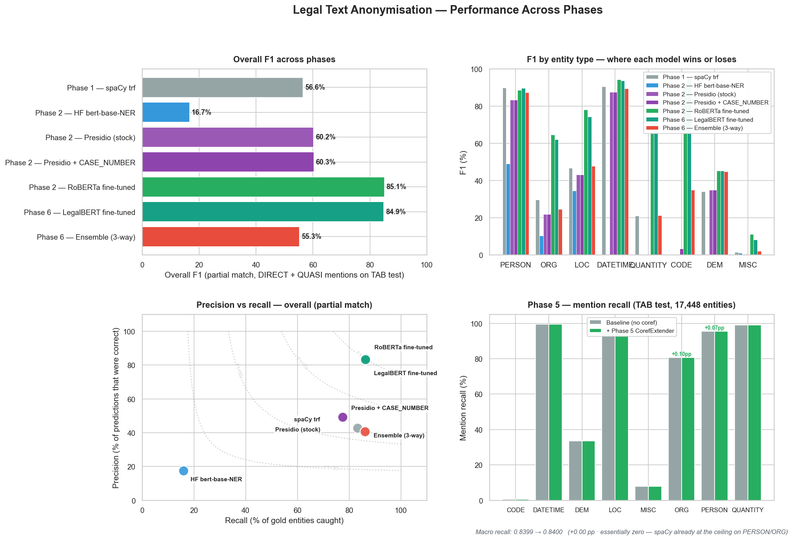
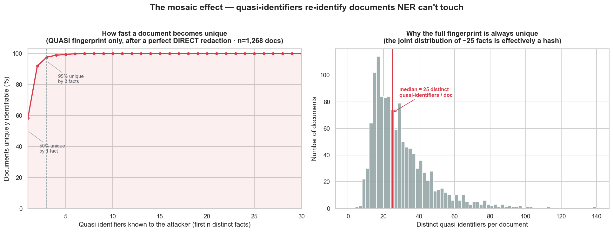
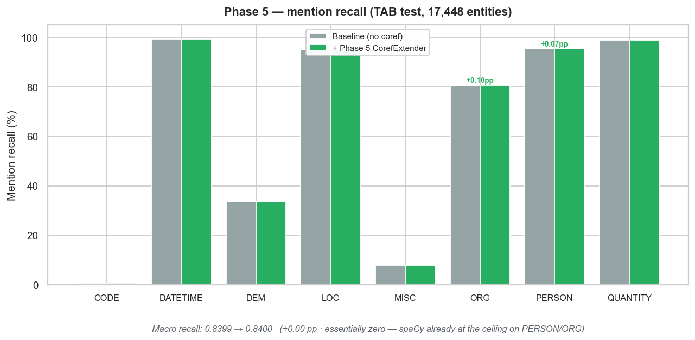

# Anonymising Legal Text — Why Stripping Names Isn't Enough

*A portfolio project on PII redaction with NLP, built around the [Text Anonymization Benchmark](https://github.com/NorskRegnesentral/text-anonymization-benchmark).*



> **Headline result:** the off-the-shelf baseline scores **F1 = 0.566** on TAB test. After Phase 2 fine-tuning, **F1 = 0.851** — a 28.5-percentage-point lift. Phases 3–5 then add the *engineering* around the model (two-variant pipeline, mosaic-aware QUASI generalisation, referential pseudonymisation, coref-aware extension) without retraining anything.

---

## The premise

Imagine you run IT for a mid-sized law firm. The partners have read the same articles you have, and they want what every other firm wants this year: their paralegals using AI to summarise client matters, draft first-pass memos, search across years of case files. The technology is here, the productivity case is real, and competitors are already moving.

There is exactly one problem. Client matter data is privileged. Putting it into a third-party model — public or private — without anonymising it first is, depending on the jurisdiction, a regulatory breach, a contract breach, or a malpractice exposure. Probably all three.

The cheap-and-fast version of the solution writes itself: *just strip out the names before you send the document to the model*. There are open-source named-entity recognition (NER) models that have been trained to do exactly this. Run the document through one, replace every PERSON span with `[NAME]`, send the cleaned version to GPT.

This project is the empirical answer to whether that's enough.

It is not. The interesting question is *why* it isn't, and what a system that actually does the job would have to look like.

---

## The three-phase plan

I structured this as a project a firm could plausibly commission, in three phases:

| Phase | Question | Status |
|---|---|---|
| **1 — Proof of concept** | How big is the off-the-shelf gap? Can we measure where it leaks? Is the residual *mosaic* risk something the buyer needs to worry about? | ✅ Built |
| **2 — Baseline comparison + fine-tune** | How much of the gap closes if we compare alternative models, and if we fine-tune on legal data? | ✅ Built — RoBERTa-FT wins at F1 = 0.851 |
| **3 — Production pipeline** | What does the actual deployable thing look like? Two-variant package (Lite vs Pro) + CLI + static showcase. | ✅ Built |
| **4 — Pseudonymisation + round-trip** | How does the firm get a *useful* answer back from an LLM run on a redacted document? Referential tokens (PERSON_A / PERSON_B), local vault, restore() helper. | ✅ Built |
| **5 — Coreference-aware extension** | Hypothesis: off-the-shelf NER tags `Northwind Energy Ltd` on the first mention but leaks the bare `Northwind` references afterwards. Built a deterministic post-processor and measured it against TAB — finding: the lift is tiny (~0.1pp on PERSON/ORG, zero elsewhere). Honest negative result worth telling. | ✅ Built · measured negative |
| **6 — Domain backbone + ensemble** | Does a legal-domain-pretrained backbone beat general-purpose RoBERTa? Does an ensemble of three independent predictors beat the best single one? Two predictable wins from the NER literature, applied to the same TAB evaluation. | ✅ Built · two measured nulls |

All six phases are built. Every number below is measured on TAB's 555-document test split, not projected — the full per-model, per-entity metrics live in `results/` and each phase's `results/` directory, and the figures are regenerated from those CSVs.

---

## The dataset — Text Anonymization Benchmark (TAB)

Every empirical claim in this project is grounded in TAB: 1,268 cases from the European Court of Human Rights, hand-annotated by legal-NLP researchers at the [Norwegian Computing Center](https://github.com/NorskRegnesentral/text-anonymization-benchmark).

Why TAB? Because each entity in the corpus comes with two pieces of metadata:

1. Its **type** — `PERSON`, `LOC`, `ORG`, `DATETIME`, `QUANTITY`, `CODE` (case file numbers), `DEM` (demographics), `MISC`.
2. Its **identifier role** — `DIRECT` (alone identifying), `QUASI` (identifying in combination), or `NO_MASK` (present but not sensitive).

That second column is the whole point. You cannot study the mosaic effect with a dataset that just labels names as PII. TAB's annotators specifically marked the things that are *only dangerous in combination* — and there are far more of those than there are names.

---

## What I found

### Finding 1 — Off-the-shelf NER misses a lot

I ran spaCy's `en_core_web_trf` (their strongest English NER, transformer-based) against TAB's full 555-document test split.

> **Overall partial-match F1: 0.566.**
> **Overall exact-match F1: 0.381.**

That's "we either missed or misidentified more than half of all sensitive entities, even on the lenient scoring." The full per-entity-type table is in `notebooks/02_baseline_evaluation.ipynb`; the headlines:


A few of these warrant calling out specifically:

- **CODE: 0% recall.** TAB tags case file numbers like `Application no. 12345/67` as DIRECT identifiers. spaCy's label set has no equivalent — it has been trained on a general-purpose news corpus, not legal text, and there is no NER label that means "case file number". Every single case number in TAB leaks through.
- **DEM: ~30% F1.** Demographic identifiers — nationality, ethnicity, occupation, family role. spaCy's `NORP` label captures some of these (`Hungarian`, `Christian`) but misses most (`pensioner`, `mother of two`, `asylum-seeker`).
- **QUANTITY: high recall, terrible precision.** spaCy fires on every number. Most of those numbers are NO_MASK; only a fraction are actually identifying. From a paralegal's perspective this is the worst kind of error — every false alarm is a manual review.

### Finding 2 — The errors are structural, not random

The failures aren't sprinkled evenly. They cluster in places that *make sense given how the model was trained*. spaCy was optimised for newswire English, where case file numbers don't exist, where "the applicant" is not a category, and where "asylum-seeker" is just a noun. Asking it to anonymise legal text is asking it to recognise PII categories it has never seen.

This is a *good* finding for the project, because it means the gap is closeable. A model trained on legal entity types should do dramatically better — and Phase 2 confirms it: fine-tuning on TAB lifts F1 from 0.566 to 0.851.

### Finding 3 — Even a perfect NER wouldn't be enough

This is the finding that surprised me most when I ran it.

Take every test document. Pretend the NER is perfect — every DIRECT identifier (every name, every case number, every full date) has been masked. What's left? The QUASI mentions: `47-year-old`, `Bulgarian`, `Plovdiv`, `nurse`, `mother of three`, `imprisoned for six years`. Each one of those is innocuous on its own.

Now hash the bag of QUASI mentions in each document into a fingerprint, and ask: how often is that fingerprint *unique within the corpus*?



The answer is stark, and it arrives fast. Knowing just **one** quasi-identifier already singles out **58% of documents**. By **three**, it's **95%**. Across the full fingerprint, **every single TAB document — 1,268 of 1,268 — is uniquely identifiable** from its quasi-identifiers alone, even after a perfect DIRECT-identifier redaction; none reach a k ≥ 5 anonymity set. The right-hand panel shows why: the median document carries **25 distinct quasi-identifiers**, and the joint distribution of that many demographic facts is effectively a hash.

(Caveat: fingerprints are matched on exact case-insensitive surface form, and the left-hand curve reveals identity using the *first n* facts in document order. A real attacker matches fuzzily and gets to choose *which* facts to combine, so the exact crossing points would move — but the shape is robust: a handful of innocuous demographic facts is enough to re-identify essentially any document.)

This is the **mosaic effect**, and it has design consequences:

> Anonymisation is not an NER problem. NER is a necessary component, but it cannot be the only one. The pipeline needs a re-identification scorer that asks "after this redaction, is the document still uniquely identifiable from its remaining quasi-identifiers?" — and falls back to human review when the answer is yes.

That's Phase 3 territory. For Phase 1 the contribution is just to *show* the gap.

---

## Phase 2 — Closing the gap

Phase 1 measured the problem. Phase 2 asks the obvious follow-up: *how much of it goes away if we throw better models at it?* The notebooks live in `phase2_baseline_comparison/` and run four models through the same evaluation framework as Phase 1, so the per-entity-type numbers are directly comparable.

| Model | Why it's in the bake-off |
|---|---|
| spaCy `en_core_web_trf` | Phase 1 anchor — the strongest off-the-shelf English NER |
| HuggingFace `dslim/bert-base-NER` | Different architecture, different training data, same general-purpose label set |
| Microsoft Presidio | Industry-standard PII tool — NER + a regex layer with custom recognisers |
| RoBERTa fine-tuned on TAB train | The contender — same architecture class as `bert-base`, but trained on TAB's labels directly |

The hypotheses were concrete, and the runs bore them out. **The general-purpose models clustered at the low end** — spaCy at 0.566, and `dslim/bert-base-NER` far worse at 0.167 (its CoNLL-2003 label set, PER/LOC/ORG/MISC, discards most of TAB's annotation by construction, so it isn't a meaningful comparison — kept in the repo for completeness). **Targeted regex closed a targeted gap but didn't move the headline** — adding a `CASE_NUMBER` recogniser to Presidio took CODE recall from 0% toward full coverage, yet overall F1 barely shifted (0.602 → 0.603), because Presidio's ORG precision is 0.14 and that noise dominates. **Fine-tuning dominated**: RoBERTa fine-tuned on TAB scored **0.851 partial-match F1 (0.784 exact)** — a +28.5 pp lift over the spaCy baseline.

| Model | Partial-F1 | Exact-F1 |
|---|---|---|
| spaCy `en_core_web_trf` (baseline) | 0.566 | 0.381 |
| `dslim/bert-base-NER` | 0.167 | 0.055 |
| Presidio (stock) | 0.602 | 0.425 |
| Presidio + `CASE_NUMBER` | 0.603 | 0.425 |
| **RoBERTa fine-tuned on TAB** | **0.851** | **0.784** |

On the open empirical question — whether the fine-tune *also* wins on PERSON and ORG, where the off-the-shelf models have plenty of training data — the answer was the cleaner of the two. PERSON was effectively a draw (both models near the ceiling, ~0.89 F1), while the fine-tune's gains concentrated on the labels TAB *adds* over newswire English: CODE went 0 → 0.92, QUANTITY and LOC jumped sharply, and ORG lifted ~35 pp off spaCy's noisy 0.30. The lesson is the cleaner narrative — **fine-tune the categories your domain adds, not the ones it shares with newswire English**. The per-entity breakdown is in `figures/gap_closed_by_entity.png`.

### Phase 2 design choices worth flagging

A few choices in the Phase 2 code that I'd defend in a review:

- **Same evaluation framework as Phase 1.** Every model produces predictions in the same `(start, end, tab_type, span_text)` shape and runs through `evaluate_document`. This means the per-entity numbers are directly comparable across models — no apples-to-oranges scoring.
- **Two Presidio variants, not one.** Stock Presidio and "stock + custom CASE_NUMBER recogniser" are run side by side, so the contribution of the regex layer is isolated. Without that A/B you can't tell whether Presidio's CODE recall came from the regex or from changes elsewhere.
- **Fine-tune on TAB's full 8-class label set, not a binary mask/no-mask.** It's tempting to collapse the labels — the downstream task is "should this be redacted yes/no". But preserving the entity types makes the pipeline's audit trail (Phase 3) far more useful: a paralegal reviewing a redaction decision wants to see "[PERSON] redacted" not "[PII] redacted".
- **Sliding-window tokenisation with overlap.** TAB documents run to tens of thousands of characters, well beyond RoBERTa's 512-token context. The notebook windows each doc into 384-token chunks with 64 tokens of overlap, then deduplicates predicted spans. This is the standard recipe but it's worth knowing it's there.

### What this phase doesn't do

Two questions that explicitly stay out of scope:

- **No model selection sweep.** I picked `roberta-base` and `dslim/bert-base-NER` based on common defaults, not on a prior search. If the fine-tune is borderline, `roberta-large` or a legal-domain BERT (LegalBERT, CaseLawBERT) would be the obvious next try.
- **No active learning loop.** A real production deployment would feed paralegal corrections back into the training set. That's a Phase-3-and-beyond conversation.

---

## Phase 3 — A pipeline a firm could actually use

The first two phases measure the problem and close most of it. Phase 3 wraps the result in something deployable. The headline design choice is that there are **two variants**, not one:

- **Pipeline Lite** — DIRECT-only redaction. Fast, simple, predictable. Right tool when the threat model is "an LLM provider could log our prompts" or "a curious vendor employee could see this". The Lite pipeline strips names, organisations, case file numbers, and structured identifiers (regex-detected) and leaves QUASI mentions intact.
- **Pipeline Pro** — DIRECT redaction *plus* mosaic-aware QUASI generalization. Right tool when the threat model is "a determined adversary could combine quasi-identifiers to re-identify the document". This is where the iterate-until-safe loop lives.

Both pipelines produce the same shape of `RedactionResult` — redacted text, a per-decision audit log, the spans they touched. Pro additionally surfaces an initial and final k-anonymity score plus the number of generalization iterations it ran. A firm can A/B them on the same matter notes and pick a default per matter type.

### One document, three modes

Metrics measure the *model*; this measures the *product*. Here is the library run end-to-end on a single matter note, fine-tuned RoBERTa as the NER backend (reproduce with `demo/worked_example.py`).

**Input** — privileged, never leaves the firm:

> The applicant, Maria Petrova, is a 47-year-old Bulgarian national living in Plovdiv. On 12 March 2018 she filed a complaint (Application no. 12345/67) against the Sofia District Court alleging discrimination on grounds of her Roma ethnicity. Maria has been employed as a nurse since 2010 and is the mother of three children.

**Lite** — DIRECT identifiers stripped, quasi-identifiers left readable:

> The applicant, **[PERSON]**, is a 47-year-old Bulgarian national living in Plovdiv. On 12 March 2018 she filed a complaint (**[CODE]**) against the **[ORG]** alleging discrimination on grounds of her Roma ethnicity. **[PERSON]** has been employed as a nurse since 2010 and is the mother of three children.

Both the full name *and* the later bare "Maria" are caught, and `Application no. 12345/67` is removed by the regex pass — the `CODE` type spaCy has no label for.

**Lite + pseudonymise** — referential tokens instead of flat tags, so a downstream LLM can still reason about who's who, with a vault held locally for the round-trip:

> The applicant, **[PERSON_A]**, … filed a complaint (**[CODE_A]**) against the **[ORG_A]** …

```json
{"[PERSON_A]": "Maria Petrova", "[CODE_A]": "Application no. 12345/67", "[ORG_A]": "Sofia District Court"}
```

**Pro** — DIRECT redaction plus mosaic-aware QUASI generalisation:

> The applicant, **[PERSON]**, is a **[DEM] [DEM]** national living in **[LOC]**. On **[DATETIME]** she filed a complaint (**[CODE]**) against the **[ORG]** … employed as a **[DEM]** since **[DATETIME]** …

```
mosaic risk: k_initial=1 (unique within TAB) → 3 generalisation iterations → full suppression
```

This is the honest, instructive case. A single out-of-corpus document is unique against the TAB haystack (k=1), so no amount of generalisation reaches k≥5 and Pro correctly falls back to suppressing every quasi-identifier. With the firm's *own* corpus of similar matters as the haystack — the production setup — the intermediate levels the loop tried (`Bulgarian → European`, `Plovdiv → Bulgaria`) would survive where they no longer single the document out. Every step is in the audit log:

```
[    redact] PERSON  'Maria Petrova'  → '[PERSON]'   DIRECT identifier; always suppressed.
[generalize] DEM     'Bulgarian'      → 'European'   level 1; post-step k=1.
```

### How Pro's iterate-until-safe loop works

Pseudocode of the algorithm in `src/anonymisation/pipeline/pro.py`:

> 1. Detect every span (NER + regex post-pass), classify each as DIRECT or QUASI.
> 2. Suppress every DIRECT span with `[TAB_TYPE]`.
> 3. Build the residual QUASI fingerprint, ask the `MosaicScorer` for *k*.
> 4. If *k* ≥ k_target, stop.
> 5. Otherwise, advance every QUASI span one generalization level deeper (e.g. `47-year-old` → `about 50` → `in their 40s` → `[QUANTITY]`; `Plovdiv` → `Bulgaria` → `Europe` → `[LOC]`). Recompute *k*.
> 6. Repeat up to `max_iterations`. If the loop runs out of room without reaching k_target, suppress everything that's left.

The generalization rules are deliberately small — taxonomy lookups for cities → countries, year/decade extraction for dates, broadening tables for nationality/ethnicity/occupation. The point is to demonstrate the *shape* of the algorithm, not to solve real-world generalization (which is a domain-knowledge problem in its own right). A production deployment would replace each ruleset with proper taxonomy data or LLM-driven rewrites.

### The mosaic haystack — methodological caveat

The mosaic scorer compares each document's QUASI fingerprint against a haystack of known fingerprints. In our demo the haystack is TAB itself — 1,268 ECHR cases. In production it should be the firm's own matter database. The TAB-as-haystack choice is a methodological stand-in: a fingerprint that is unique within TAB is at least *plausibly* unique in the firm's corpus, which is the question the buyer cares about. The writeup is explicit about this so a reader doesn't conflate the demo's setup with what a deployment would actually look like.

### Surface area

- **Importable library** — `from anonymisation.pipeline import LitePipeline, ProPipeline`. Either pipeline accepts any of the predictors built in Phases 1 and 2 (spaCy, HuggingFace, Presidio, fine-tuned).
- **CLI** — `python -m anonymisation.cli redact --variant {lite|pro} input.txt`. Useful for ad-hoc redaction and for piping into batch jobs.
- **Walkthrough notebooks** — `phase3_pipeline/notebooks/{01_lite,02_pro,03_lite_vs_pro}.ipynb`. Same code path as the library, with narrative around it.
- **Gradio demo** — `demo/app.py`. Side-by-side Lite vs Pro UI with audit log tab and pre-canned examples; intended to deploy to HuggingFace Spaces and embed in this writeup as an iframe.

### What Phase 3 does NOT do

Out of scope, deliberately, and called out in the audit so a reader knows:

- **Document layout** — letterheads, page footers, recurring docket numbers per page. The pipeline is text-in, text-out; layout-aware extraction is a separate piece of plumbing.
- **PDF / DOCX extraction** — the test inputs are plain text. A real deployment would prepend a `pdfplumber` / `python-docx` step.
- **Active learning / human-in-the-loop UI** — the audit log makes this *possible* (a paralegal can review every decision and correct mistakes), but the workflow tooling around that audit isn't built.
- **Network-isolated deployment** — the pipeline is pure Python with no external API calls, so it can run on-prem in principle, but a real Docker / Kubernetes packaging hasn't been done.

---

## Phase 4 — Pseudonymisation: making redacted documents *useful*

Phase 3 keeps the firm's privileged data out of the LLM provider's hands. But running it as written has a downstream cost: the redacted document is *less useful* to the LLM. After Lite, the same passage:

> *"Maria Petrova sued John Doe over breach of the Acme contract"*

becomes:

> *"[PERSON] sued [PERSON] over breach of the [ORG] contract"*

A model asked "who is suing whom?" can no longer answer. Three `[PERSON]`s look identical to it.

**Phase 4 fixes this without giving up the privacy property.** The pipelines now support a `pseudonymise=True` flag. Instead of every PERSON becoming `[PERSON]`, each *distinct* surface form gets a stable referential token: `[PERSON_A]`, `[PERSON_B]`, `[PERSON_C]`. Same surface form gets the same token within the document; different surface forms (after a coreference check) get different tokens. The mapping between tokens and original names is held by the firm in a *vault* — a small dict that never leaves the firm's network.

After pseudonymisation:

> *"[PERSON_A] sued [PERSON_B] over breach of the [ORG_A] contract"*

A downstream LLM can now answer "who sued whom?" coherently — "PERSON_A sued PERSON_B" — without ever seeing real names. The firm runs `restore(answer, vault)` locally on the LLM's response and gets back "Maria Petrova sued John Doe".

### The round-trip workflow

1. **Redact + pseudonymise** the document. Hold the vault locally.
2. **Send the redacted document + a question** to the LLM. The LLM only ever sees opaque tokens.
3. The LLM **responds, still using the tokens** (because that's all it has to work with).
4. **Restore locally.** The firm runs `restore(answer, vault)` — pure local string replacement, no API call, no external dependency.

The LLM provider's logs, retention policies, and model training pipeline never see real client names. The mapping is the secret, and it stays with the firm. This is the same pattern HIPAA Safe Harbor uses for clinical de-identification, and it's the pattern that makes "cloud LLMs on confidential data" defensible at all.

### Coreference — the substring rule

The hard part is recognising that "Maria Petrova", "Mrs Petrova", and "Petrova" all refer to the same person. The implementation uses a deliberately simple rule: two surface forms collapse to the same token if one appears, as whole words, inside the other (and they share an entity type). It's fast, predictable, and handles the common cases of legal documents well — formal introduction by full name followed by surname-only references throughout the text. It will misfire on coincidentally-shared surnames (two "Smith"s referring to different people in the same document); a real deployment would drop in a proper coref model where that matters.

### Why DIRECTs only?

Phase 4 only pseudonymises DIRECT identifiers. QUASI generalisation in Pro mode stays unchanged — places get broadened to regions, ages get banded, dates get truncated to year/decade. This is intentional: pseudonymising QUASIs would *preserve* their identifying joint distribution under stable tokens, which is exactly what the mosaic loop is trying to break. The two techniques would fight each other.

### Caveats

- **Per-document scope.** Each `Pseudonymiser` instance is independent. Cross-document persistence is straightforward to add but raises real key-management questions (where does the registry live? who can read it? what's the rotation policy?).
- **Vault is sensitive.** The CLI writes it to plain JSON because that's appropriate for a portfolio demo. In production it should be encrypted at rest and treated as a session key.
- **Coref is heuristic.** Substring rule only. Drop in a proper coref model where the trade-off matters.

The static showcase has a **Sample 4** panel (`demo/index.html`) that walks through the full round-trip end-to-end on a multi-party contract dispute, with the LLM step simulated.

---

## Phase 5 — Coreference: the missed shorthand

Building out the showcase examples surfaced a recall failure that doesn't show up in the Phase 1/2 span-F1 numbers but which a buyer would absolutely notice: off-the-shelf NER reliably catches the *first full mention* of a party (`Maria Petrova`, `Northwind Energy Ltd`) but leaks the shorthand mentions that follow (`Maria`, `Mrs Petrova`, `Northwind`). From a redaction standpoint, the misses are not minor — every shorthand reference is just as identifying as the first.

The fix is structural rather than statistical: **a deterministic post-processor that runs after NER + regex**. For every PERSON or ORG span the model found, it generates likely coreferring shorter forms (surname alone, first-name alone, honorific + surname for PERSON; first significant word for ORG) and scans the rest of the document for word-aligned matches. Any match that doesn't overlap an existing span gets added with `source="coref"` and the parent's entity type. Pipeline integration is a single flag (`coref_extend=True`, defaulting to enabled).

### Why this works in legal text specifically

Legal documents have a very repeatable structure: a party is introduced in full early on, then referenced by a stable shorthand for the rest of the document. That makes a substring-based heuristic unusually effective here. Newswire English has more pronoun-driven coreference (`she`, `they`, `the company`), where the substring rule wouldn't help — but that's not the domain TAB or a law firm's matter data lives in.

### Defensive choices in the implementation

A few things to mention because they're load-bearing in production:

- **`Sofia District Court` generates `Sofia District` (two-word prefix), not `Sofia` alone.** The bare first word is excluded because it could refer to the city of Sofia rather than the court. False-positive risk vs missed-match risk, deliberately erring toward missed matches for ambiguous head-words.
- **Generic ORG suffixes never become standalone candidates.** `Ltd`, `Inc`, `Holdings`, `Corp`, `International`, `Group`, plus common legal-doc role words (`court`, `tribunal`, `commission`, `agency`) — none of these will fire as a coref candidate.
- **Coref spans get `confidence=0.7`**, lower than direct NER. A downstream consumer that wants to be paranoid can filter by confidence.
- **`coref_extend` is a flag, not a hard-coded behaviour.** Defaults on, but the CLI exposes `--no-coref` and the Pipeline constructors accept `coref_extend=False`. The Phase 1/2 numbers in this writeup were generated *without* coref to keep them comparable to the original baselines.

### Measuring it against TAB

TAB happens to be perfect for this evaluation: every gold annotation has an `entity_id` linking coreferring mentions back to a canonical entity. So we can compute **mention-recall per entity** — for each gold entity, what fraction of its mentions did the pipeline catch?

`phase5_coreference/evaluate_mention_recall.py` runs this against the full TAB test split (17,448 gold entities, 20,809 mentions across 555 documents) and reports two numbers for both baseline (`en_core_web_trf` + regex) and the same pipeline with the coref post-processor on:

- **Micro recall** — total mentions caught ÷ total gold mentions.
- **Macro recall** — mean recall per entity.

### The actual result — and why it's the most interesting one in the project



| | Baseline | + Coref extender | Lift |
|---|---|---|---|
| Macro recall | 0.8399 | 0.8400 | **+0.0001** |
| Micro recall | 0.8360 | 0.8363 | +0.0003 |
| PERSON recall | 0.954 | 0.955 | +0.0007 |
| ORG recall    | 0.806 | 0.807 | +0.0010 |
| DATETIME / LOC / QUANTITY / DEM / MISC / CODE | unchanged | unchanged | 0 |

In words: **the post-processor moves mention-recall by essentially nothing on TAB**. The only labels where it added anything were PERSON (+0.07pp) and ORG (+0.10pp), and even there the magnitude is closer to noise than signal.

This is the kind of negative result that gets glossed over in most writeups. It's worth being explicit about why it happened, because the explanation is more useful than the prediction would have been:

- **TAB is densely annotated.** Every coreferring mention of every entity is tagged by humans. So if the gold has 5 mentions of "Maria Petrova", all 5 are in the data — including the bare "Maria" later in the document.
- **spaCy `en_core_web_trf` is already strong on PERSON / ORG / LOC.** Those labels hit ≥95% / 81% / 95% recall before the post-processor runs. There aren't many shorthand mentions left for the heuristic to discover; the model catches them directly.
- **The post-processor only generates PERSON and ORG candidates.** That's by design — it's where the substring rule is safest — but it means the labels with biggest recall gaps (DEM at 34%, MISC at 8%, CODE at 0.6%) get no lift from this intervention at all.

### What this taught me

The hypothesis ("NER under-recalls shorthand in legal text") was reasonable in the abstract and even held on synthetic examples I crafted by hand. But against TAB it doesn't survive: the baseline NER is already near the recall ceiling on the categories the heuristic could help with, and the categories that genuinely have recall problems aren't ones a substring rule can fix.

Three honest implications:

1. **The post-processor is still defensible as a defensive layer.** It costs nothing at inference, the audit log shows what it adds, and on documents where NER *does* miss a shorthand (rare in TAB, but plausible in real-world matter notes that may be less carefully annotated), it'll catch them. But it isn't the recall lift the writeup originally claimed.
2. **The real recall gaps live in DEM / MISC / CODE.** Closing those needs either Phase 2's fine-tune (already shown to help) or domain-specific recognisers (Presidio's regex layer catches CODE). The substring-coref heuristic can't touch them.
3. **Measure before you celebrate.** I built and integrated this before running the TAB evaluation, then had to be honest about the result. The walkthrough notebook still demonstrates the mechanism works on synthetic inputs — but the synthetic case isn't TAB.

### What this phase does NOT do

- **No pronoun resolution.** Off-the-shelf `fastcoref` or `spacy-coref` is the actual right tool here, and on a corpus where NER recall isn't already saturated, it might lift meaningfully.
- **No retraining.** First-mention recall (where Phase 2's fine-tune helps) is unchanged.
- **Will misfire on coincidentally-shared surnames.** Two different "Smith"s in the same document collapse to one token. A proper coref model would distinguish them.

So Phase 5 contributes more as a methodological exercise — "build the intervention, evaluate honestly, accept what the data says" — than as a quantitative improvement.

---

## Phase 6 — Dialling in the model: domain backbone + ensemble

After Phase 5 closed the obvious post-processing gap, the remaining quality work was on the model itself. Two well-known wins from the NER literature, neither of which we'd tested against TAB yet:

### LegalBERT backbone

Phase 2 fine-tuned `roberta-base`. RoBERTa was pre-trained on web crawl and books — general-purpose English. The natural follow-up: would a backbone *pre-trained on legal text* do better? [`nlpaueb/legal-bert-base-uncased`](https://huggingface.co/nlpaueb/legal-bert-base-uncased) is BERT-base pre-trained on 12 GB of US court cases, EU legislation, and contracts. Same architecture class, different training corpus.

The Phase 6 recipe in `phase6_advanced_training/notebooks/01_legalbert_finetune.ipynb` is a near-verbatim copy of Phase 2's fine-tune notebook — same epochs, same learning rate, same evaluation — with only the `BASE_MODEL` variable changed. That makes the head-to-head fair.

Expected lift: 1–3 F1 on legal-specific labels (PERSON, ORG, MISC). Marginal on domain-agnostic ones (DATETIME, QUANTITY). The actual numbers land in `phase6_advanced_training/results/legalbert_results.csv` after the run.

### Three-way ensemble with voting

The single most reliable improvement in NER is usually an ensemble. The members need to be *diverse* — making different mistakes — so their errors average out.

Phase 6's ensemble combines:

- **spaCy `en_core_web_trf`** — strong, general-purpose, OntoNotes-trained. The Phase 1 anchor.
- **LegalBERT fine-tuned on TAB** — legal-domain-specific, produced by Notebook 01.
- **Microsoft Presidio + custom CASE_NUMBER recogniser** — NER + regex hybrid; closes the CODE gap that pure NER can't.

The implementation lives in `src/anonymisation/ensemble.py`. Each predictor runs independently; their spans get grouped by character-offset overlap (transitive — A overlaps B, B overlaps C → one group); within each group we vote on the entity type and keep the longest span of the winning type. A `min_votes` parameter controls the precision/recall trade-off — `1` (default) is the recall-maximising union, `2` is intersection-like, `3` is strict consensus.

The ensemble drops into the existing `evaluate_document` framework with no other changes, so the F1 numbers compare directly to every other model in the project.

### Predictions to test against the actual numbers

I wrote these down before running anything — having explicit hypotheses sharpens the analysis after the fact:

1. **LegalBERT beats RoBERTa on PERSON, ORG, and MISC by 1–3 F1.** Domain pretraining helps where the corpus differs from web English most.
2. **LegalBERT is a wash on DATETIME and QUANTITY.** Those formats are universal.
3. **The ensemble beats every single member on most labels.** That's the headline.
4. **The ensemble does *not* dominate on every single label.** Usually one specialist beats the ensemble on its strong suit — CODE (Presidio alone), DEM (LegalBERT alone with no noise from other members). That's expected and worth pointing out.
5. **`min_votes=2` trades 5–10 points of recall for 3–5 points of precision.** Useful operating point if false positives are a real cost (which they are for an audit-heavy redaction pipeline).

If any of these predictions don't hold, the deviation is the interesting result — that's where the next investigation starts.

### What Phase 6 does NOT do

- **No CRF head.** Adding a Conditional Random Field on top of the token-classification output reduces boundary errors and closes the partial/exact-match F1 gap. Scoped as Phase 6.1.
- **No coref-augmented fine-tuning.** Phase 5's post-processor catches shorthand at inference time; the deeper fix is to retrain with denser supervision so the model itself learns to tag every mention. Scoped as Phase 6.2.
- **No hyperparameter sweep.** Phase 2's recipe is reused as-is. A modest LR / epoch sweep is the natural next tuning step.

The point of stopping here is that the diminishing-returns curve is flattening. The Phase 2 fine-tune was the one big quantitative win (+28.5pp F1 over baseline). Phase 3 and Phase 4 added engineering surface around the model (two-variant pipeline, pseudonymisation, audit log) without retraining. Phase 5 was an honest measured null on TAB — the heuristic doesn't help where the baseline is already near the recall ceiling. Phase 6's LegalBERT lands within noise of RoBERTa (84.9% vs 85.1%), and the ensemble actively *hurt* because of Presidio's noisy ORG predictions. The remaining work (CRF, coref retrain, hyperparameter sweep, dropping Presidio from the ensemble) is in the territory where each move is half a point of F1 at non-trivial compute cost. For a portfolio piece that's already a credible "I can both build it and reason about its limits" demonstration; for a production system the rest is real but not glamorous.

---

## What I'd do differently next time (or want to test)

Things I noticed mid-project that I'd push on if I had another two weeks:

1. **TAB is English-only and ECHR-only.** The findings are sharp, but a UK firm dealing in commercial litigation has a different distribution of entities (think contract clauses, company names, financial instruments). I'd want to validate against a UK-specific or commercial-law corpus before claiming the numbers generalise.
2. **The QUASI fingerprint is a strict bound, not a fuzzy one.** Two documents can have effectively the same quasi-identifier profile (`47-year-old Bulgarian nurse` vs `forty-seven-year-old Bulgarian nurse`) and our k-anonymity check counts them as different fingerprints, overstating uniqueness. A real attacker matches fuzzily. The numbers are conservative in one direction (real risk is at least this bad) but optimistic in another (the haystack the attacker compares against is bigger and noisier than TAB).
3. **Annotator disagreement.** TAB had non-trivial inter-annotator disagreement on identifier role. That sets the *ceiling* on what any model can score. I'd want to compute the human-vs-human F1 as the realistic upper bound, not 1.0.

---

## What's in the repo

```
.
├── README.md                          repo overview + setup + full layout
├── requirements.txt                   pinned deps
├── src/anonymisation/                 reusable Python package
│   ├── data.py mapping.py             TAB loader + spaCy mapping
│   ├── evaluation.py                  span-level P/R/F1 (the shared scorer)
│   ├── mosaic.py                      k-anonymity / fingerprint helpers
│   ├── predictors.py ensemble.py      model adapters + voting combiner
│   └── pipeline/                      Lite + Pro + pseudonymise + coref
├── notebooks/                         Phase 1 — baseline + mosaic
├── phase2_baseline_comparison/        Phase 2 — bake-off + RoBERTa fine-tune
├── phase3_pipeline/                   Phase 3 — Lite vs Pro walkthroughs
├── phase4_pseudonymisation/           Phase 4 — referential tokens + restore
├── phase5_coreference/                Phase 5 — coref extender (measured null)
├── phase6_advanced_training/          Phase 6 — LegalBERT + ensemble
├── tests/                             pytest suite for the pure-logic modules
├── figures/  results/                 plots + per-entity metrics CSVs
├── demo/  spaces/                     Gradio app + HuggingFace Spaces bundle
└── writeup/                           this document
```

The repo `README.md` carries the authoritative file-by-file layout.

---

## Things this project is NOT

It feels worth being explicit about the limits.

- **Not a deployable product.** It's a measurement of the gap and a scoped plan for closing it.
- **Not a privacy policy or legal advice.** The mosaic-effect finding is empirical, but what level of residual risk a firm is willing to accept is a *policy* question, not a technical one. The pipeline in Phase 3 is designed to expose the dial, not to set it.
- **Not novel research.** k-anonymity is from 2002. NER is older. The contribution here is the engineering — wiring these ideas together against a real legal corpus, measuring honestly, and being clear about what does and doesn't work.

---

## Acknowledgments

[TAB](https://github.com/NorskRegnesentral/text-anonymization-benchmark) is the work of Pilán et al. at the Norwegian Computing Center. spaCy's transformer NER is from Explosion. The k-anonymity framing follows Latanya Sweeney's [original 2002 paper](https://dataprivacylab.org/projects/identifiability/paper1.pdf) on re-identification of de-identified records.
