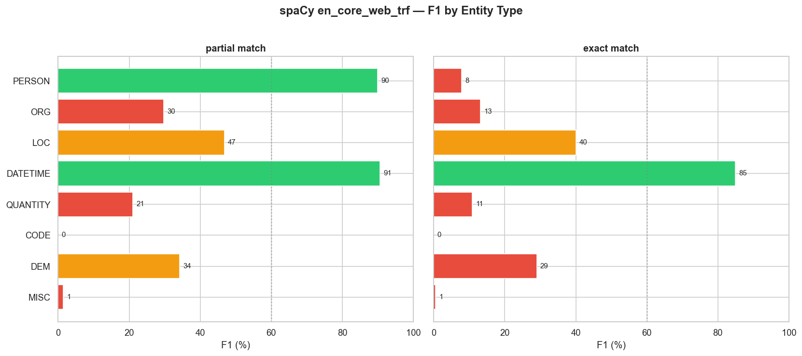
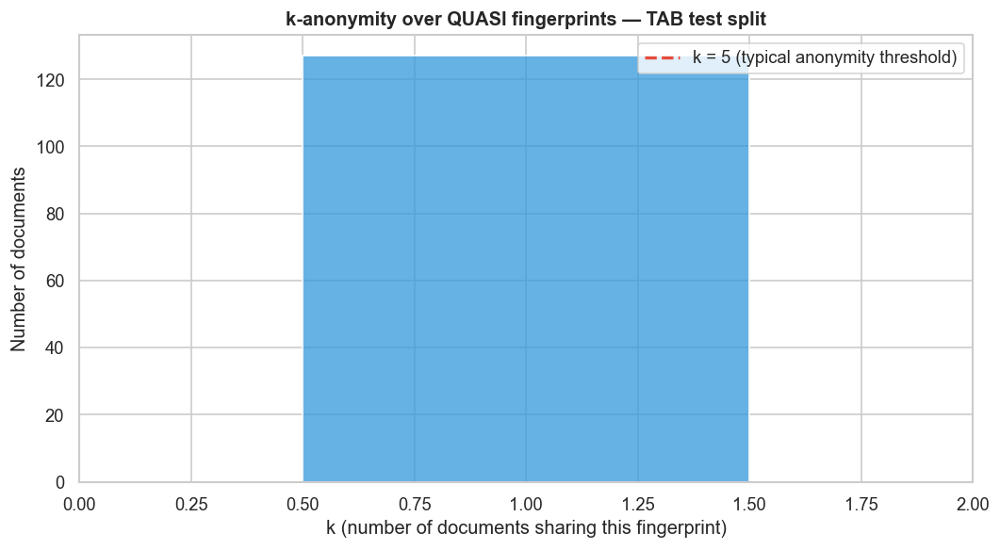

# Anonymising Legal Text — Why Stripping Names Isn't Enough

*A portfolio project on PII redaction with NLP, built around the [Text Anonymization Benchmark](https://github.com/NorskRegnesentral/text-anonymization-benchmark).*

---

## The premise

Imagine you run IT for a mid-sized law firm. The partners have read the same articles you have, and they want what every other firm wants this year: their paralegals using AI to summarise client matters, draft first-pass memos, search across years of case files. The technology is here, the productivity case is real, and competitors are already moving.

There is exactly one problem. Client matter data is privileged. Putting it into a third-party model — public or private — without anonymising it first is, depending on the jurisdiction, a regulatory breach, a contract breach, or a malpractice exposure. Probably all three.

The cheap-and-fast version of the solution writes itself: *just strip out the names before you send the document to the model*. There are open-source named-entity recognition (NER) models that have been trained to do exactly this. Run the document through one, replace every PERSON span with `[NAME]`, send the cleaned version to GPT.

This project is the empirical answer to whether that's enough.

It is not. The interesting question is *why* it isn't, and what a system that actually does the job would have to look like.

---

## The three-phase plan

I structured this as a project a firm could plausibly commission, in three phases:

| Phase | Question | Status |
|---|---|---|
| **1 — Proof of concept** | How big is the off-the-shelf gap? Can we measure where it leaks? Is the residual *mosaic* risk something the buyer needs to worry about? | ✅ Built |
| **2 — Baseline comparison + fine-tune** | How much of the gap closes if we compare alternative models, and if we fine-tune on legal data? | 🟡 Code complete, runs pending |
| **3 — Production pipeline** | What does the actual deployable thing look like? NER + regex post-pass + mosaic-risk scorer + audit log + human-in-the-loop fallback. | 📋 Scoped |

This writeup focuses on Phase 1 — what's built, what it found, what it implies. Phase 2 and 3 are scoped in `phase2_baseline_comparison/README.md` and `phase3_pipeline/README.md` in the repo.

---

## The dataset — Text Anonymization Benchmark (TAB)

Every empirical claim in this project is grounded in TAB: 1,268 cases from the European Court of Human Rights, hand-annotated by legal-NLP researchers at the [Norwegian Computing Center](https://github.com/NorskRegnesentral/text-anonymization-benchmark).

Why TAB? Because each entity in the corpus comes with two pieces of metadata:

1. Its **type** — `PERSON`, `LOC`, `ORG`, `DATETIME`, `QUANTITY`, `CODE` (case file numbers), `DEM` (demographics), `MISC`.
2. Its **identifier role** — `DIRECT` (alone identifying), `QUASI` (identifying in combination), or `NO_MASK` (present but not sensitive).

That second column is the whole point. You cannot study the mosaic effect with a dataset that just labels names as PII. TAB's annotators specifically marked the things that are *only dangerous in combination* — and there are far more of those than there are names.

---

## What I found

### Finding 1 — Off-the-shelf NER misses a lot

I ran spaCy's `en_core_web_trf` (their strongest English NER, transformer-based) against TAB's full 555-document test split.

> **Overall partial-match F1: 0.57.**
> **Overall exact-match F1: 0.39.**

That's "we either missed or misidentified more than half of all sensitive entities, even on the lenient scoring." The full per-entity-type table is in `notebooks/02_baseline_evaluation.ipynb`; the headlines:



A few of these warrant calling out specifically:

- **CODE: 0% recall.** TAB tags case file numbers like `Application no. 12345/67` as DIRECT identifiers. spaCy's label set has no equivalent — it has been trained on a general-purpose news corpus, not legal text, and there is no NER label that means "case file number". Every single case number in TAB leaks through.
- **DEM: ~30% F1.** Demographic identifiers — nationality, ethnicity, occupation, family role. spaCy's `NORP` label captures some of these (`Hungarian`, `Christian`) but misses most (`pensioner`, `mother of two`, `asylum-seeker`).
- **QUANTITY: high recall, terrible precision.** spaCy fires on every number. Most of those numbers are NO_MASK; only a fraction are actually identifying. From a paralegal's perspective this is the worst kind of error — every false alarm is a manual review.

### Finding 2 — The errors are structural, not random

The failures aren't sprinkled evenly. They cluster in places that *make sense given how the model was trained*. spaCy was optimised for newswire English, where case file numbers don't exist, where "the applicant" is not a category, and where "asylum-seeker" is just a noun. Asking it to anonymise legal text is asking it to recognise PII categories it has never seen.

This is a *good* finding for the project, because it means the gap is closeable. A model trained on legal entity types should do dramatically better. That's exactly what Phase 2 will test.

### Finding 3 — Even a perfect NER wouldn't be enough

This is the finding that surprised me most when I ran it.

Take every test document. Pretend the NER is perfect — every DIRECT identifier (every name, every case number, every full date) has been masked. What's left? The QUASI mentions: `47-year-old`, `Bulgarian`, `Plovdiv`, `nurse`, `mother of three`, `imprisoned for six years`. Each one of those is innocuous on its own.

Now hash the bag of QUASI mentions in each document into a fingerprint, and ask: how often is that fingerprint *unique within the corpus*?



A large chunk of TAB test documents have a fingerprint shared by *no other document* — they are uniquely identifiable from their quasi-identifiers alone, even after a perfect DIRECT-identifier redaction. The exact percentage prints in the notebook; what matters here is the qualitative point.

This is the **mosaic effect**, and it has design consequences:

> Anonymisation is not an NER problem. NER is a necessary component, but it cannot be the only one. The pipeline needs a re-identification scorer that asks "after this redaction, is the document still uniquely identifiable from its remaining quasi-identifiers?" — and falls back to human review when the answer is yes.

That's Phase 3 territory. For Phase 1 the contribution is just to *show* the gap.

---

## Phase 2 — Closing the gap

Phase 1 measured the problem. Phase 2 asks the obvious follow-up: *how much of it goes away if we throw better models at it?* The notebooks live in `phase2_baseline_comparison/` and run four models through the same evaluation framework as Phase 1, so the per-entity-type numbers are directly comparable.

| Model | Why it's in the bake-off |
|---|---|
| spaCy `en_core_web_trf` | Phase 1 anchor — the strongest off-the-shelf English NER |
| HuggingFace `dslim/bert-base-NER` | Different architecture, different training data, same general-purpose label set |
| Microsoft Presidio | Industry-standard PII tool — NER + a regex layer with custom recognisers |
| RoBERTa fine-tuned on TAB train | The contender — same architecture class as `bert-base`, but trained on TAB's labels directly |

The hypotheses are concrete. **General-purpose models will cluster together** at ~0.5–0.6 F1, because they share the same fundamental problem: their label sets don't fit legal text. **Targeted regex closes targeted gaps** — adding a `CASE_NUMBER` recogniser to Presidio should take CODE recall from 0% to near-100%, but won't help anywhere else. **Fine-tuning dominates on TAB-specific labels** — CODE, DEM, and MISC should all jump dramatically with a model that has actually seen them in training.

Whether the fine-tune also wins on PERSON and ORG (where the off-the-shelf models have plenty of training data) is the interesting empirical question. Both possible answers say something useful: a clean fine-tune sweep argues for "always retrain on your domain"; a draw on PERSON/ORG with a sweep elsewhere argues for the cleaner narrative "fine-tune the categories your domain *adds*, not the ones it shares with newswire English".

The plots from `04_head_to_head.ipynb` will land here once the notebooks have been executed.

### Phase 2 design choices worth flagging

A few choices in the Phase 2 code that I'd defend in a review:

- **Same evaluation framework as Phase 1.** Every model produces predictions in the same `(start, end, tab_type, span_text)` shape and runs through `evaluate_document`. This means the per-entity numbers are directly comparable across models — no apples-to-oranges scoring.
- **Two Presidio variants, not one.** Stock Presidio and "stock + custom CASE_NUMBER recogniser" are run side by side, so the contribution of the regex layer is isolated. Without that A/B you can't tell whether Presidio's CODE recall came from the regex or from changes elsewhere.
- **Fine-tune on TAB's full 8-class label set, not a binary mask/no-mask.** It's tempting to collapse the labels — the downstream task is "should this be redacted yes/no". But preserving the entity types makes the pipeline's audit trail (Phase 3) far more useful: a paralegal reviewing a redaction decision wants to see "[PERSON] redacted" not "[PII] redacted".
- **Sliding-window tokenisation with overlap.** TAB documents run to tens of thousands of characters, well beyond RoBERTa's 512-token context. The notebook windows each doc into 384-token chunks with 64 tokens of overlap, then deduplicates predicted spans. This is the standard recipe but it's worth knowing it's there.

### What this phase doesn't do

Two questions that explicitly stay out of scope:

- **No model selection sweep.** I picked `roberta-base` and `dslim/bert-base-NER` based on common defaults, not on a prior search. If the fine-tune is borderline, `roberta-large` or a legal-domain BERT (LegalBERT, CaseLawBERT) would be the obvious next try.
- **No active learning loop.** A real production deployment would feed paralegal corrections back into the training set. That's a Phase-3-and-beyond conversation.

---

## What I'd do differently next time (or want to test)

Things I noticed mid-project that I'd push on if I had another two weeks:

1. **TAB is English-only and ECHR-only.** The findings are sharp, but a UK firm dealing in commercial litigation has a different distribution of entities (think contract clauses, company names, financial instruments). I'd want to validate against a UK-specific or commercial-law corpus before claiming the numbers generalise.
2. **The QUASI fingerprint is a strict bound, not a fuzzy one.** Two documents can have effectively the same quasi-identifier profile (`47-year-old Bulgarian nurse` vs `forty-seven-year-old Bulgarian nurse`) and our k-anonymity check counts them as different fingerprints, overstating uniqueness. A real attacker matches fuzzily. The numbers are conservative in one direction (real risk is at least this bad) but optimistic in another (the haystack the attacker compares against is bigger and noisier than TAB).
3. **Annotator disagreement.** TAB had non-trivial inter-annotator disagreement on identifier role. That sets the *ceiling* on what any model can score. I'd want to compute the human-vs-human F1 as the realistic upper bound, not 1.0.

---

## What's in the repo

```
.
├── README.md                          repo overview + setup
├── requirements.txt                   pinned deps
├── src/anonymisation/                 reusable Python package
│   ├── data.py                        TAB loader
│   ├── mapping.py                     TAB ↔ spaCy entity mapping
│   ├── evaluation.py                  span-level P/R/F1
│   ├── demo.py                        try-it-yourself helper
│   └── mosaic.py                      k-anonymity / fingerprint helpers
├── notebooks/
│   ├── 01_problem_setup.ipynb         EDA + framing + first taste of the mosaic
│   ├── 02_baseline_evaluation.ipynb   spaCy vs TAB — the core experiment
│   └── 03_mosaic_effect.ipynb         re-identification deep dive
├── figures/                           saved plots used in this writeup
├── results/                           per-entity-type metrics CSV
├── phase2_baseline_comparison/        scoped, not yet implemented
├── phase3_pipeline/                   scoped, not yet implemented
├── demo/                              live-demo plan + (later) Gradio app
└── writeup/                           this document
```

---

## Things this project is NOT

It feels worth being explicit about the limits.

- **Not a deployable product.** It's a measurement of the gap and a scoped plan for closing it.
- **Not a privacy policy or legal advice.** The mosaic-effect finding is empirical, but what level of residual risk a firm is willing to accept is a *policy* question, not a technical one. The pipeline in Phase 3 is designed to expose the dial, not to set it.
- **Not novel research.** k-anonymity is from 2002. NER is older. The contribution here is the engineering — wiring these ideas together against a real legal corpus, measuring honestly, and being clear about what does and doesn't work.

---

## Acknowledgments

[TAB](https://github.com/NorskRegnesentral/text-anonymization-benchmark) is the work of Pilán et al. at the Norwegian Computing Center. spaCy's transformer NER is from Explosion. The k-anonymity framing follows Latanya Sweeney's [original 2002 paper](https://dataprivacylab.org/projects/identifiability/paper1.pdf) on re-identification of de-identified records.
